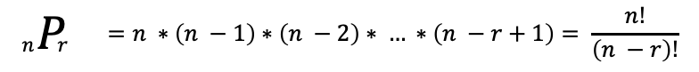
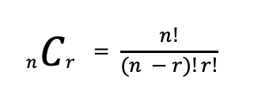

# 순열과 조합

[연습문제 링크](practice.md)

Brute Force는 어떤 알고리즘 문제에 대해 가능한 모든 경우의 수를 탐색하는 알고리즘 문제 해결 방식.
이를 위해 순열과 조합을 만드는 방법을 알아야 한다.

## 순열

서로다른 n개의 원소 중 r개를 고르는 것을 순열이라 하며, `nPr`로 그 경우의 수를 나타낸다.



### 단순한 순열 제작

`for`를 중첩하여 순열을 만들 수 있다.

```java
// 0 부터 2사이 하나 선택
for (int i = 0; i < 3; i++) {
    // 0 부터 2 사이 숫자 중,
    for (int j = 0; j < 3; j++) {
        // 앞에서 선택하지 않은 숫자 선택
        if (i == j) continue;

        // 0 부터 2 사이 숫자 중,
        for (int k = 0; k < 3; k++) {
            // 앞에서 선택하지 않은 숫자 선택
            if (i == k || j == k) continue;
            // 출력
            System.out.println(i + " " + j + " " + k);
        }
    }
}
```

단, 이 경우 `r`의 값이 커지면 (골라야 하는 원소가 많아지면) `for`를 늘리기 어렵다는 문제가 존재

### 재귀함수로 순열 생성

재귀함수를 이용해 `for`의 중첩을 해결할 수 있다.

```java
private void permNumbers(
        int n, 
        int r, 
        // 이번 재귀 호출이 몇번째 숫자를 선택하는 것인지
        int k, 
        // 결과 저장용 배열
        int[] perm, 
        // 사용한 요소 확인용 배열
        boolean[] used
) {
    // k == r 이면 순열 완성
    if (k == r) {
        System.out.println(Arrays.toString(perm));
    }
    else {
        for (int i = 0; i < n; i++) {
            // i가 이미 사용되었으면 건너뛴다.
            if (used[i]) continue;
            // 이번에 선택한 결과를 저장한다.
            perm[k] = i;
            // 사용했다고 기록하고,
            used[i] = true;
            // k를 하나 증가해 재귀 호출한다.
            this.permNumbers(n, r, k + 1, perm, used);
            // 재귀 호출이 끝나면 다른 숫자를 고르기 위해 기록을 원복
            used[i] = false;
        }
    }
}
```

## 조합

서로다른 n개의 원소 중 r개를 순서와 상관없이 선택하는 것을 조합이라 하며, `nCr`로 그 경우의 수를 나타낸다.



### 단순 조합 제작

`for` 중첩으로 조합을 생성한다. 순열은 데이터를 나열한다면, 조합은 데이터의 선택 여부가 중요하다.
```java
int n = 5;
// i 는 0 부터 n - 2 까지 반복해야 안쪽 반복문에서 선택할 요소가 남는다.
for (int i = 0; i < n - 2; i++) {
    // j 는 i + 1 부터 n - 1 까지
    for (int j = i + 1; j < n - 1; j++) {
        // k 는 j + 1 부터 n 까지
        for (int k = j + 1; k < n; k++) {
            // 마지막 순간의 i, j, k 는 n - 2, n - 1, n이 된다.
            System.out.printf("%d %d %d%n", i, j, k);
        }
    }
}
```
그래서 제일 첫 `for`에서 모든 원소를 후보로 삼을 수 없다.

### 재귀함수로 조합 생성

`for` 중첩 대신 재귀함수를 사용하며, 선택의 여부를 배열로 저장한다.

```java
private void combNumbers(
        int n, int r,
        // 몇번째 원소를 고르고 있는지
        int k,
        // 어떤 숫자를 판단하고 있는지
        int next,
        // 현재 완성한 조합
        int[] comb
) {
    // k == r: 고를 만큼 원소를 골랐다
    if (k == r) {
        System.out.println(Arrays.toString(comb));
    }
    // next == n: 고르기 전 고를 대상이 떨어졌다
    else if(next == n) {
        return;
    }
    else {
        // comb[k]에 이번에 판단중인 숫자를 우선 할당한다.
        comb[k] = next;
        // next를 선택하고, k + 1번째 원소를 판단하러 넘어간다.
        combNumbers(n, r, k + 1, next + 1, comb);
        // next를 선택하지 않고 k번째 원소를 판단하러 넘어간다.
        // next를 선택하지 않으면 comb[k]에 할당한 next는 덮어씌워진다.
        combNumbers(n, r, k, next + 1, comb);
    }
}
```
